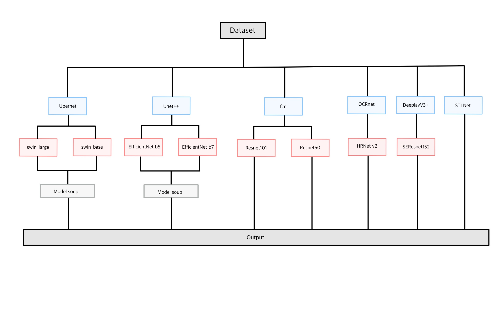
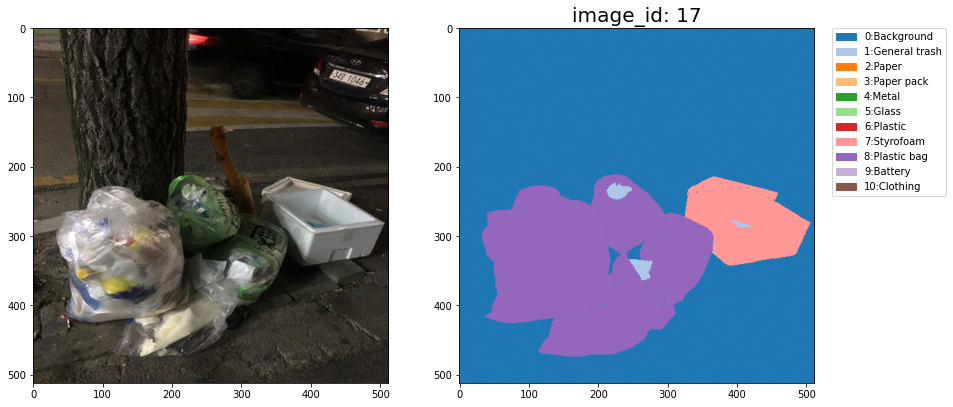
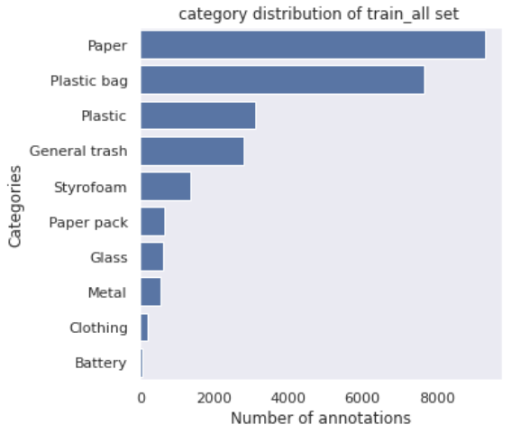
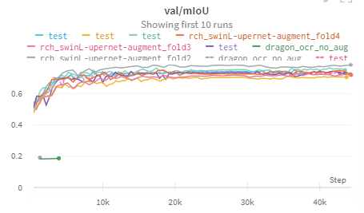
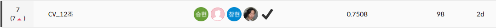

# [부스트캠프] level-02 Semantic Segmentation 팀랩업리포트

# 1. 프로젝트 개요

우리는 많은 물건이 대량으로 생산되고, 소비되는 시대를 살고 있지만 이러한 문화는 '쓰레기 대란', '매립지 부족'과 같은 여러 사회 문제를 낳고 있다.

분리수거는 이러한 환경 부담을 줄일 수 있는 방법 중 하나인데 분리 배출이 잘 된 쓰레기는 자원으로서 가치를 인정받아 재활용되지만, 분리 배출이 잘못 되면 그대로 폐기물로 분류되어 매립 또는 소각된다.

사진에서 쓰레기를 Segmentation 하는 모델을 만들어 이러한 문제점을 해결해보고자 한다. 문제 해결을 위한 데이터셋으로는 일반 쓰레기, 플라스틱, 종이, 유리 등 10 종류의 쓰레기가 찍힌 사진 데이터셋이 제공된다.

이 데이터셋으로 쓰레기 사진이 들어있는 input data 에서 Semantic segmentation task를 진행하여 분리수거를 하는 것이 이번 competition의 목표이다.

- **모델 개요**

# 2. 프로젝트 팀 구성 및 역할

- **김승현**: Swin + Upernet Test , Model soup
- **노창현**: Swin + Upernet Test ,Kfold
- **최홍록**: 데이터 전처리 실험, STLNet 테스트 , data EDA
- **최진아**: UNet++ + EfficientNet_b5 Test, Kfold, TTA
- **최용원**: OCR + HRNetv2, EfficientNet_bn7 + UNetPlusPlus, UNet3+, self training

 

# 3. 프로젝트 수행 절차 및 결과

## 3.1 탐색적 분석 및 전처리

- **Segmentation 예시**
    
    
    
- **class별 분포**

- **학습시 class별 mIoU**
    - class의 개수는 model 성능에 유의미한 영향을 미치지는 않는 것으로 파악

## 3.2 K-FOLD

KFOLD를 적용시키기 위해 각 클래스 별 분포에 맞게 FOLD를 나눠주었다.

각 FOLD 당 train set : validation set = 8 : 2 비율로 나누어 주어 FOLD 별 mIoU를 확인해 일반화 성능을 확인하였다. 이를 통해 Cross validation으로 모델의 일반화를 하였다.

## 3.3 Data Augmentation

augmentation은 학습 시 torchvision보다 빠르다고 알려져 있는 albumentation 라이브러리를 사용했으며 generalization performance를 끌어올리기 위해 여러가지 transform을 적용하였다.

- `brightness`
- `contrast`
- `saturation`
- `Hue`
- `RGBshift`
- `random image rotate`
- `random flip`
- `blur`
- `medium blur`
- `resize`
- `normalize`
- `PhotoMetricDistortion`
- `Random Crop`
- `Morphology(closing)`

## 3.4 Optimizer , Learning Scheduler

- `AdamW`와 `cosine annealing`을 사용하였다.
- learning rate을 수정해 성능을 높였다.

## 3.5 Model

| Model  | Backbone |
| --- | --- |
| Upernet | • Swin Large
• Swin Base |
| UNet++ | • EfficientNet b5
• EfficientNet b7 |
| fcn | • Resnet101
• Resnet50 |
| OCRnet | • HRNetv2 |
| STLNet(Learning-Statistical-Texture-for-Semantic-Segmentation) |  |
| Deeplabv3+ | • SEResnet152 |

## 3.6 TTA

`ttach`라이브러리를 이용하여 TTA를 시도해보고 inference 결과를 sampling해서 시각화했을 때 segmentation 성능이 향상되는 것을 확인할 수 있었다.

- `HorizontalFlip`
- `Rotate90`
- `Multi Scale`
- `merge_mode="mean”`

## 3.7 Loss function

- class imbalance 문제를 해결하기 위해 Focal loss + dice loss 조합을 써서 dice loss와 crossentropy loss를 따로 썼을 때보다 확실히 좋은 성능을 보여주었다.
- crossentropy loss + dice loss 조합의 loss function을 사용함으로써 Focal loss + dice loss 보다 훨씬 안정적이고 성능의 소폭 상승을 보여주었다.

## 3.8 Ensemble

- cross validation을 포함한 model을 학습시키며 performance가 잘  나온 것들을 추려내었고 pixel 별로 hard voting 하여 kfold 별 결과 값들을 Ensemble 하였다.

## 3.9 Model Soup

- [https://arxiv.org/abs/2203.05482](https://arxiv.org/abs/2203.05482)
- 성능 향상을 위하여 Kfold로 나눈 데이터들을 같은 모델에 학습 시킨 후 valiation dataset의 mIOU greedy soup를 통한 model weight값 조정 혹은 uniform soup를 통하여 model weight값을 조정하였다.

## 3.10 결과물

 

- **Weight & Biases**

- 대회 결과
LB score - **public : 0.7372**
              - **private : 0.7508**
    
    **Final Rank : 7/19 th place**
    
    
    

- **최종 모델**
    
    Swin Large Kfold 0~4 (**Model Soup Ensemble**)
    

# 4. 자체 평가 의견

- **잘한 점들**
    - 다양한 모델들을 앙상블하여 성능 향상을 할 수 있었다.
    - 같은 모델들을 `Model soup` 하여 성능 향상을 할 수 있었다.
    - 협업을 통해 긴 시간 학습하는 모델의 단점을 보완할 수 있었다.
    - 협업툴로써 **[Weights & Biases](https://wandb.ai/site)**를 잘 활용했다
    - `mmsegmentation`, `SMP` 에서의 여러 모델들을 사용하며 다양한 실험을 진행하였고 `wandb` 를 통한 협업을 경험하였다
    
- **시도 했으나 잘 되지 않았던 것들**
    - general trash에 대한 mIOU가 낮아 아이디어가 떠오르지 않아 성능 향상을 하지 못하였다.
    - 논문 성능 재현에 실패했다
    
- **아쉬웠던 점들**
    - 계속된 대회로 burn out으로 인해 100% 몰두하지 못하였다.
    - Data 측면으로 접근하지 못하고 Model에 비중을 두었다.